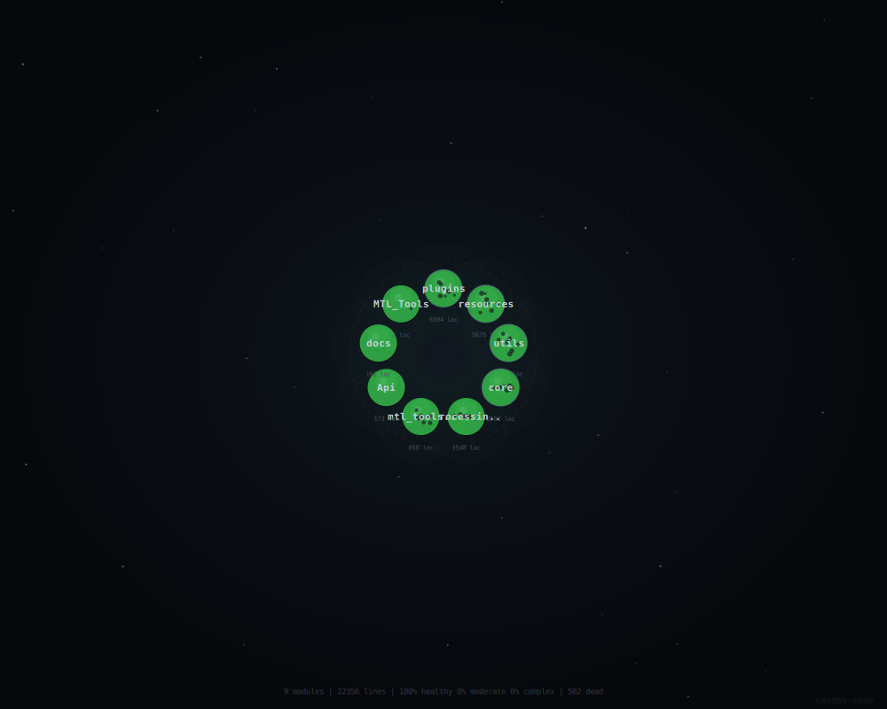

# 🧰 Cadmus QGIS Plugin

 

**Cadmus** é um conjunto avançado de ferramentas para **QGIS** focado em **automação de layouts**, **processamento vetorial/raster**, **otimização de fluxos cartográficos** e **produtividade agrícola/geoespacial** 🗺️⚙️🚜

Desenvolvido pela **[MTL Agro]**, reúne soluções profissionais para **exportação em lote**, **edição massiva**, **análises automatizadas** e **ferramentas interativas**, reduzindo drasticamente etapas manuais.

[](resources/images/canopy.svg)

## 🚀 Ferramentas Principais

| Ícone | Ferramenta | Descrição |
|-------|------------|-----------|
|  | **Exportar Todos os Layouts** | Exportação automática de todos os layouts para PDF/PNG com merge opcional |
|  | **Replace Text in Layouts** | Substituição de textos em massa com backup automático (.qgz) |
|  | **Salvar, Fechar e Reabrir** | Reinicia QGIS preservando projeto com salvamento automático |
|  | **Carregar Pasta de Arquivos** | Carregamento recursivo de vetores/rasters com preservação de grupos |
|  | **Gerar Rastro de Implemento** | Gera faixas de cobertura agrícola a partir de linhas |
|  | **Consulta de Coordenadas** | Clique no mapa: WGS84 (dec/DMS), UTM SIRGAS2000 + altimetria SRTM |
|  | **Estatísticas de Atributos** | Estatísticas descritivas de campos numéricos → CSV |
|  | **Gerador de Diferenças** | Campos com diferenças numéricas automáticas |
|  | **Amostragem Massiva de Rasters** | Extrai valores de múltiplos rasters em pontos |
|  | **Coordenadas de Drone** | Processa arquivos MRK → camada vetorial |
|  | **Copiar Atributos** | Transferência seletiva de atributos entre camadas |
|  | **Converter Multipart** | Separa geometrias multipart em singlepart |
|  | **LogCat Viewer** | Visualizador avançado de logs JSONL |

## 🏗️ Arquitetura Técnica

**Design modular e thread-safe** com 9 módulos principais (**22k+ LOC**, 100% saudável):

```
Cadmus/
├── plugins/     (6k+ LOC) - 13 ferramentas UI
├── resources/   (5k+ LOC) - WidgetFactory, Styles, ícones
├── utils/       (4k+ LOC) - Dependencies, ProjectUtils, Preferences
├── core/        (3k+ LOC) - AsyncPipelineEngine, LogUtils
├── processing/  (1k+ LOC) - Algoritmos QGIS Processing
├── docs/        (100+ LOC) - Arquitetura detalhada
```

### Destaques Arquiteturais
- **AsyncPipelineEngine**: Processamento assíncrono seguro com `QgsTask` + `BaseStep`
- **WidgetFactory**: UI padronizada e modular (AppBar, MainLayout)
- **LogUtils**: Logging JSONL thread-safe com rotação automática
- **ProjectUtils**: Backup .qgz, manipulação segura de camadas
- **ToolKeys**: Identificação única + cores para 13+ ferramentas

**Compatibilidade**: QGIS 3.16 → 4.x | Python 3.9+

## 📦 Instalação

1. **QGIS Plugin Manager** → Buscar "Cadmus" → Instalar
2. **Manual**:
   ```
   1. Baixar ZIP
   2. Plugins → Gerenciar e Instalar Plugins → ZIP
   3. Reiniciar QGIS
   ```

**Dependências Automáticas**: PyPDF2, Pillow (instaladas via `DependenciesManager`)

## 🎛️ Configuração

- **Settings** (ícone ⚙️): Preferências globais + reset
- **Preferences**: Persistência automática por ferramenta
- **LogCat**: Visualizador de logs para debugging avançado

## 📚 Documentação Técnica

- [Arquitetura Plugins](docs/arquitetura/plugins_arquitetura.md)
- [Pipeline Assíncrono](docs/arquitetura/PIPELINE_ENGINE.md)
- [Sistema de Logs](docs/arquitetura/LOGGING_SYSTEM.md)
- [WidgetFactory & UI](docs/arquitetura/resources_arquitetura.md)
- [Utils & Contratos](docs/arquitetura/utils_arquitetura.md)

## 🤝 Créditos & Licença

**Desenvolvido por**: [MTL Agro](https://mtlagro.com.br/)  
**Status**: Production Ready | **Versão**: 1.0+  
**Licença**: [GPL-3.0](LICENSE)

 **Contato**: martinelli.matheus2@gmail.com

---

⭐ **Star no GitHub** | 🐛 **Issues** | 📖 **Wiki**
